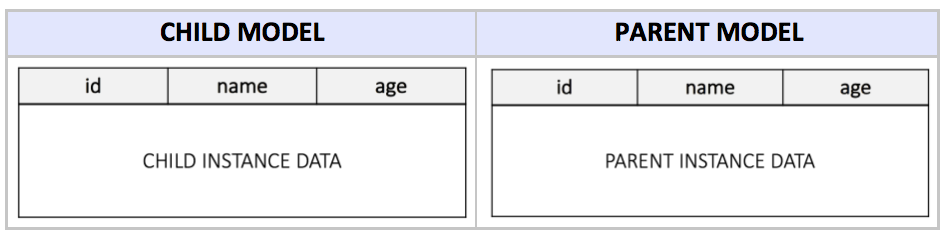
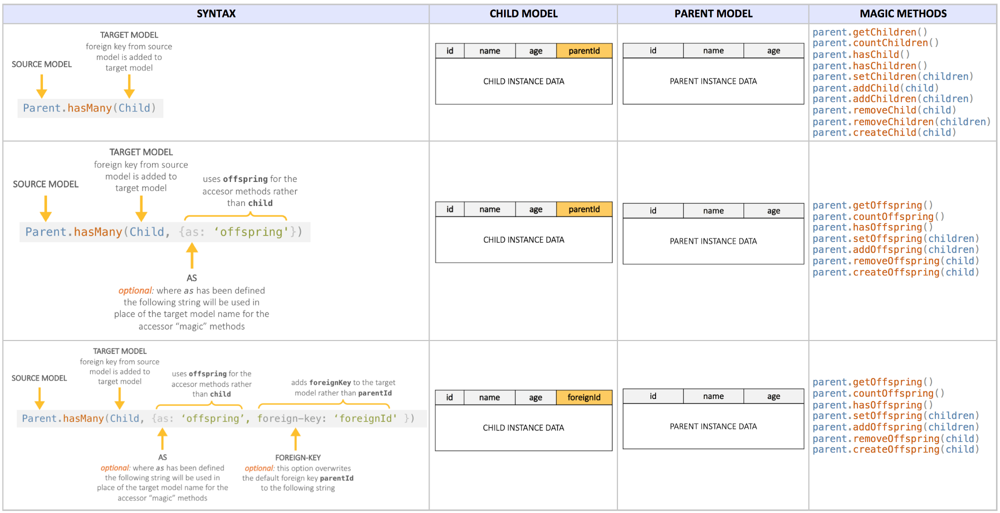
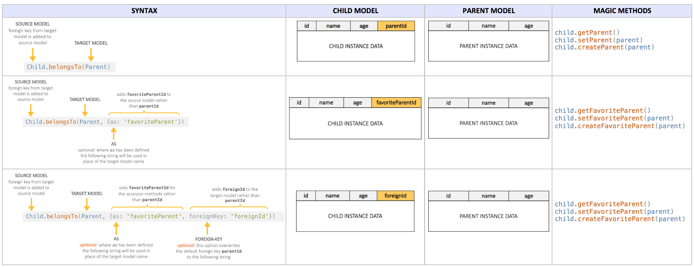

## Objective

The objective of this project is to provide more understandable (visual) documentation on Sequelize associations and magic methods.

## Motivation

When implementing a backend database, Sequelize is a powerful and effective object relational mapping (ORM) platform. Some of its capabilities, however, are obscured by pages of deterring and dense documentation. 

### Associations & Magic Methods
An association in Sequelize is a relationship between two models (a source and a target model). Creating an association generally involves adding a foreign key to one model which creates a reference to the other. There are several Sequelize associations, including _hasOne_, _belongsTo_, _hasMany_, and _belongsToMany_. In terms of implementation, the key difference between these associations is in which model (the source or the target) the foreign key resides.

"Magic methods" are simply methods that are generated by defining Sequelize associations. As their name implies, the capabilities they invoke are quite magical. The visualizations below also outline which magic methods a given association will create.

### Starting Point

#### Base Models
For this demo, we will have two base models; a parent and a child model that are connected with one-to-many relationship. One-to-Many associations connect one source with multiple targets. The targets however, are connected to exactly one specific source. The tables below show how the 2 Sequelize associations affect these base models, and what magic methods are created as a result.



#### Parent Has Many Child



#### Child Belongs To Parent

Associations where the foreign key exists on the source model.



### Joins
Since the 2 tables have one-to-many association, we can easily get the associated data by just adding `include: [<models>]` as an option in our queries.

Add the "include" option to the queries below. This is a feature called "eager loading". We want to "include" the `Child` model when retrieving `Parent` data:

```js
  db.Parent.findOne({ 
    where: { id: req.params.id },
    include: [db.Child] // <-----------  join 2 tables to get child data as well
  }).
  then((data) => {
    res.json(data);
  });
```

We also want to "include" the `Parent` model when retrieving `Child` data:

```js
  db.Child.findOne({ 
    where: { id: req.params.id },
    include: [db.Parent] // <-----------  join 2 tables to get parent data as well
  })
  .then((data) => {
    res.json(data);
  });
```

Please take a look at the code in the repo. Once you understand these differences, Sequelize is extremely powerful in establishing relational databases and querying data.
